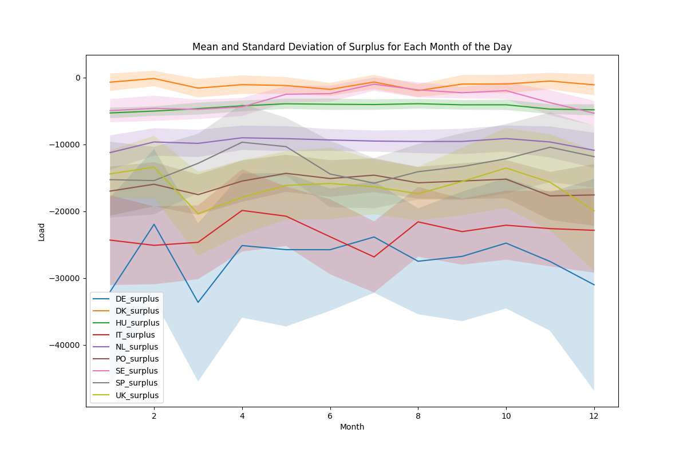

# Table of Contents <a id="top"></a>
1. [About The Project](#about)
2. [Getting Started](#getstart)
3. [Execution ](#execution)
4. [Data Ingestion](#ingest)
5. [Insights [1/8]](#ins1)
6. [Data Processing ](#proc)
7. [Insights [2/8]](#ins2)
8. [Model](#model)
9. [Contributing ](#Contributing )
10. [License]( #license)
11. [Contact](#contact) 

## About The Project <a id="about"></a>
This prediction model is designed to forecast the European country that will likely have the highest surplus of green energy in the next hour. The project was developed in accordance with the specifications for the challenge of the [EcoForecast Contest: Revolutionizing Green Energy Surplus Prediction in Europe](https://nuwe.io/dev/competitions/schneider-electric-european-2023/ecoforecast-revolutionizing-green-energy-surplus-prediction-in-europe). The generated model provides a label indicating which of the listed countries will have the most surplus of green energy, determined by the formula max(Total green energy generated - Load). 

The main functionality of the project can be summarized as follows:
* Gather all the data from ENTSO-E.
* Gather all the data for UK from Elexon. [OPTIONAL] [[More info]](#ukreason)
* Clean the data:
	* Drop all non-renewable energy columns.
	* Gather the data in 1-hour intervals.
	* Fill the gaps.
	* Combine all the green energy specific columns (per country) into one (per country).
	* Calculate the labels.
* Develop a model.
* Train the model.
* Save the results as a json file.
* Evaluate the performance of the model and calculate insights.

In case the previous full web description of the challenge is not available, you can check it [here](/doc/challenge_description.pdf). IMPORTAR

### Built Using
Base technologies:
* [Python](https://www.python.org/)
* [Tensorflow](https://www.tensorflow.org/)
* [Keras](https://keras.io/)

Additional dependencies:
* [NumPy](https://numpy.org/)
* [Pandas](https://pandas.pydata.org/)

<p align="right">(<a href="#top">back to top</a>)</p>

## Getting Started <a id="getstart"></a>
Given that [Python 3.9+](https://www.python.org/downloads/) and [pip](https://pip.pypa.io/en/stable/) are installed and correctly configured in the system, and that you have [CUDA-capable hardware](https://developer.nvidia.com/cuda-gpus) installed, you may follow these steps.

### Prerequisites

* [NVIDIA CUDA Toolkit](https://developer.nvidia.com/cuda-downloads) version 11.0 or above is correctly installed.
* [NVIDIA cuDNN](https://developer.nvidia.com/cudnn) version 7 or above is correctly installed.

### Installation

1. Clone this repository locally.

```bash
git clone git@github.com:sperezacuna/schneider-challenge-r1.git
```
2. Create a new [pip environment](https://docs.python-guide.org/dev/virtualenvs/), with all dependecies installed.

```bash
NOOOOOOOOOOOO
$ mkvirtualenv project_folder
pip create --name <env> --file requirements.txt
```

3. Activate it.

```bash
NOOOOOOOOOOOOOOOOOOO
pip activate <env>
```
<p align="right">(<a href="#top">back to top</a>)</p>

## Execution <a id="execution"></a>
### How to execute
TODO

### Flow of the code
This project is meant to be run through a single script, [run_pipeline.sh](../scripts/run_pipeline.sh). The script does the following:
1.	 Activates the  [conda environment](https://docs.conda.io/projects/conda/en/latest/commands/create.html).
2.	 Installs the [requirements](../requirements.txt).
3.	 Runs the [data ingestion script](../src/data_ingestion.py).
4.	 Runs the [data processing script](../src/data_processing.py).
5.  Runs the [model prediction script](../src/model_prediction.py).

<p align="right">(<a href="#top">back to top</a>)</p>

## Data Ingestion <a id="ingest"></a>
### Download ENTSO-E data
First of all,  the program requests the  data for each of the countries to the ENTSO-E API and stores it in "partial" dataframes, one per country and column, in dictionaries. 

!!!!!!!!!!!!! CAMBIAR          !This is done in two different methods, one to get the load, other to get all the energies,.

Given that the API permits downloading either one data type per request or all available data for a country in a single request, to minimize the number of requests made, we opted to download all the data at once. Subsequently, we will process the entirety of the data, confident that handling 10 MB of data is manageable for everyone.

It's important to note that the API imposes a restriction on the data request, allowing a maximum of 1-year periods. In cases where the specified period exceeds 1 year (i.e., (end date - start date) > 1 year), the script will constrain the request to cover only 1 year beyond the start date.

You can check all the relevant data that we use, such as tokens or countries, in the [src/constants.py](src/constants.py) file.

### Download Elexon data [OPTIONAL] [[More info]](#ukreason)
In case you run the script with the only_entsoe setting, you may skip this section. 

If you choose to run it without the only_entsoe option (which is both the default and recommended), the data for the UK will not be fetched from ENTSO-E but rather from Elexon. The subsequent process remains identical to the one previously explained for ENTSO-E. However, it's crucial to consider the following particularities:
- Different energy codes are used: biomass is represented by B01, ps (pumped storage) is denoted as B10, and wind combines B18 and B19. Since there isn't empirical data to distribute wind separately, and given that it doesn't affect the final model, we just add it all up to B18.
-   The API restricts load data requests to 28 days or less.
-   To obtain a 30-minute sampling, requests for generated energy must not exceed a duration of 14 days.

### Concatenate partial dataframes
After downloading the partial dataframes the program concatenates them. The resulting dataframe will have only one ID and timestamp, being ordered by both.EXPLAINNN

<p align="right">(<a href="#top">back to top</a>)</p>

## Insights [1/8] <a id="ins1"></a>
Let's check what data we have ingested:
- We have 8XXX rows.
- We have XX colums, 

TODO IN SCRIPT:
-  How many data points have we ingested?
- new source

<p align="right">(<a href="#top">back to top</a>)</p>

## Data Processing  <a id="proc"></a>
### Identify green energy sources
First of all, it's crucial to identify which energy sources are considered renewable. Referencing the ENTSO-E [Statistical Factsheet 2022](https://eepublicdownloads.blob.core.windows.net/public-cdn-container/clean-documents/Publications/Statistics/Factsheet/entsoe_sfs2022_web.pdf), published in June 2023, the current list comprises the following green energy sources:
- B01 - Biomass
- B09 - Geothermal
- B11 - Hydro Run-of-river and Poundage
- B12 - Hydro Water Reservoir
- B13 - Marine
- B15 - Other Renewable
- B16 - Solar
- B18 - Wind Offshore
- B19 - Wind Onshore

If you are not calculating the total green energy generation for year 2023, it's highly recommended to verify if the list has changed, as updates are common. In the past, certain fields like Waste were included, but they are no longer part of the green energy category.

Setting aside ENTSO-E considerations, we have opted to incorporate B10 - Hydro Pumped Storage.  This decision is driven by a more recent [study](https://www.bizjournals.com/portland/inno/stories/news/2023/08/28/pumped-storage-beats-batteries-in-climate-impact.html?csrc=6398&taid=64ee555298b0c4000132ffe3&utm_campaign=trueAnthemTrendingContent&utm_medium=true), which  suggests that it should be considered as green energy.

In case you want to modify the final list, you can do  it by editing the [src/constants.py](src/constants.py) file.

### Drop all non renewable energy columns
First of all, the program loads the dataframe with all the data ingested. Given the presence of both integers and floats in the dataset, we found it necessary to standardize the data for proper treatment. We decided to use floats because the neural model we use requires this type of data, although it weights more.

Following this, the program contrasts the columns of the dataset with the previously created list of renewable energies, generating a new list of the columns that we must drop. Lastly, it drops them all at once.

### Gather the data in 1-hour intervals
Give the structure of the data ingestion, we can assume that the data starts at the onset of each hour and is sampled at 15-minute intervals. To group the rows from 4 to 1, we make the entire division of the index (index // 4). Regarding the data, if the 4 rows interval only has NaNs, we leave it as NaN, if it has at least a number, we do the mean.

### Interpolation
In the same method that we do the 1-hour interval merge, we fill all the gaps. For a series containing exclusively 0s, we preserve them as such. If the series has at least one field of data, we use a linear interpolation (average of the previous and next values).

### Calculate total green energy per country
Now that we have the dataframe with all the necessary and treated data, we can calculate the green energy per country. To do this we just sum of all the columns that are in the previously created list of green energy.

To facilitate subsequent exploratory analysis, we have opted to calculate the surplus for each country and store the results. It's important to note that this surplus field is eliminated just before passing the dataframe to the model to prevent the introduction of excessive noise into the neural network.

Once the total green energy generated by each country is calculated, the specific information about each energy source becomes redundant. Consequently, we drop all the columns that are in the green energy list.

### Label calculation
Last but not least, we create a new dataframe to compute the label. Then we fill each row with the index of the country who has the most (green energy - load) in the countries array. Since we try to predict which country will have the most surplus in the next hour, we do a basic 1-shift operation. Then, we drop the last row since we do not have the necesary data to calculate the label. Lastly, we concatenate the main dataframe with the labels dataframe.

<p align="right">(<a href="#top">back to top</a>)</p>

## Insights [2/8] <a id="ins2"></a>

TODO IN SCRIPT:
-   Do we loose any data during data processing?
-   Which data have we lost?
-   Why did we loose it? However, it is up to you to define the specific measures you are monitoring.

Let's summarise what data we have lost:
- We lost 3/4 of the rows since originally we had 15 minute intervals and now we have 1 hour intervals. Additionaly, notice that the 1/4 of the remaining rows may have changed since we did the mean to calculate it. If for the hour interval we had no values, it will be... ESPECIFICAR CADA CASO 
- We lost all the specific green energy columns (10 sources * 9 countries = 90 less columns), but we gained one total green energy column per country (9 columns). This means that we reduced the information contained in 90 columns in only 9, a 90% downsize! 
-  We lost all the not green related columns
<p align="right">(<a href="#top">back to top</a>)</p>

### Exploratory analysis [1]  (Only ENTSO-E data)

Upon scrutinizing the total amount of green energy generated per country, a notable observation emerges: both the UK and HU contribute significantly less to renewable energy generation. While the smaller size of HU (approximately 1/5th that of Spain) can account for its comparatively lower output, the UK, being substantial in size, appears capable of producing more.


Upon reviewing the total load per country, anomalies have come to light, with the UK once again presenting surprises.<p align="right">(<a href="#top">back to top</a>)</p>

### Dealing with UK anomaly <a id="ukreason"></a>
If we examine the data we currently have, it is possible to appreciate that the UK is lacking a significant amount of data. Also, the values provided for both generation and load are surprisingly low.

The [challenge](https://nuwe.io/dev/competitions/schneider-electric-european-2023/ecoforecast-revolutionizing-green-energy-surplus-prediction-in-europe) states that the goal of this hackaton is:
>to create a model capable of predicting the country (from a list of nine) that will have the most surplus of green energy in the next hour.
>
Delving deeper into the data, we observed that the majority of entries were interpolated. In order to achieve a precise and realistic solution it's mandatory to understand why are there so many missing data? Is the information that we have accurate?


After conducting extensive research, we identified the root cause of the problem; following June 15th 2021, due to Brexit, both BZN and GB ceased all data publication on ENTSO-E. The data we previously ingested was solely from Northern Ireland. You can verify this information on the [official publication](https://commission.europa.eu/strategy-and-policy/relations-non-eu-countries/relations-united-kingdom/eu-uk-trade-and-cooperation-agreement_en). For a more comprehensive understanding of the situation, you may refer to the following sites:
- [Brexit impact on Northen Island](https://www.mondaq.com/uk/oil-gas-electricity/1046512/brexit-impact-on-northern-ireland39s-electricity-supply)
- [Northern Ireland Protocol](https://en.wikipedia.org/wiki/Northern_Ireland_Protocol)
- [Blog thread about ENTSO-E UK data](https://groups.google.com/g/openmod-initiative/c/1JGZYhuV76s?pli=1)

Since Nuwe explicitly states in the objective section that we must consider the UK country (which is not only the information received by  ENTSO-E), we have identified at least three alternatives to address this issue:
1. Remove the UK: Discarded as it is a candidate supposed to be considered.
2. Make an estimation: Discarded as there is not a single piece of data that corresponds to the UK as a whole.
3. Gather the missing information from another source.

Since there is a [platform](https://developer.data.elexon.co.uk/) that offers the data for the UK publicly, we firmly believe this is the best option and, therefore, we chose it. However, it is possible to not use this data if you use the option "only_entsoe", in case this is "not allowed" by any non-stated rule.

<p align="right">(<a href="#top">back to top</a>)</p>

### Exploratory analysis [2]  (ENTSO-E & Elexon data)

The UK anomaly has been successfully resolved using the Elexon API to fetch the info for the UK.


Now, let's examine the statistical distribution of the surplus for each country. According to the chart, it seems that any country could be the possible winner, but let's dig in a bit deeper to get a more accurate lecture.  


This graphic shows the mean of the hourly surplus per country, with one standard deviation. Referencing the the [empirical rule](https://statisticsbyjim.com/probability/empirical-rule/):
-   Approximately 68% of the data falls within one standard deviation of the mean [shadows printed in the chart].
-   Approximately 95% falls within two standard deviations.
-   Approximately 99.7% falls within three standard deviations.

Hence, taking in consideration two standard deviations, it can be concluded that any country has the potential to lead in terms of surplus. However,  the first three (DK, SE, and HU) are more likely to exhibit the higher surplus.
<p align="right">(<a href="#top">back to top</a>)</p>

## Model <a id="model"></a>
<p align="right">(<a href="#top">back to top</a>)</p>

## Contributing <a id="contributing"></a>

This project is being developed during the course of a competition, so PRs from people outside the competition will **not** be **allowed**.

Don't forget to give the project a star!

<p align="right">(<a href="#top">back to top</a>)</p>

## License <a id="license"></a>

This project has been developed in accordance with Schneider's and Nuwe's terms and conditions. For further details and legal criteria related topics, please refer to the [official terms](https://cdn.nuwe.io/challenge-asset-files/Schneider_Electric_European_2023/Schneider%20Electric%20European%20Hackathon%202023-Terms%20&%20Conditions.OK.pdf).

<p align="right">(<a href="#top">back to top</a>)</p>

## Contact <a id="contact"></a>

Santiago Pérez Acuña - santiago@perezacuna.com

Victor Figueroa Maceira - victorfigma@gmail.com

<p align="right">(<a href="#top">back to top</a>)</p>