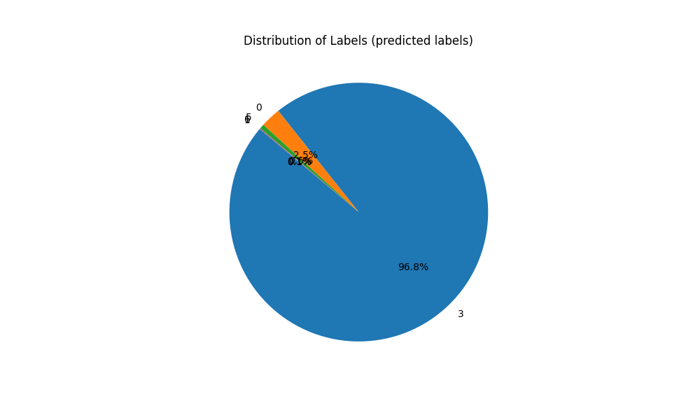
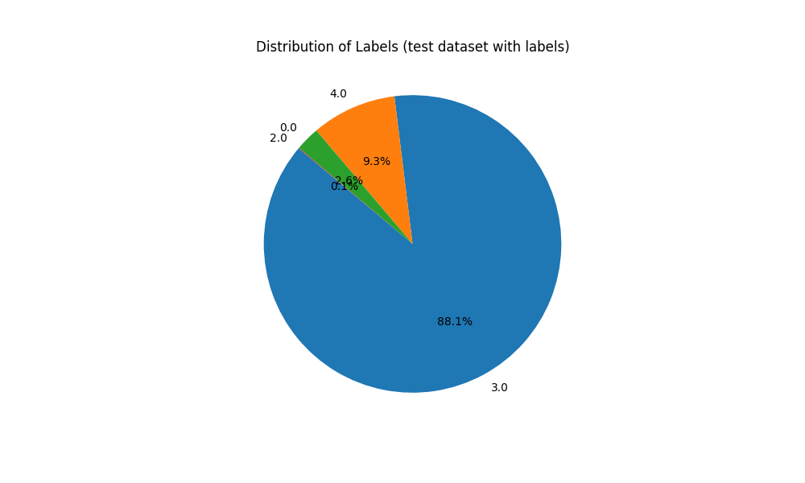

## About The Project <a id="about"></a>
This prediction model is designed to forecast the European country that will likely have the highest surplus of green energy in the next hour. The project was developed in accordance with the specifications for the challenge of the [EcoForecast Contest: Revolutionizing Green Energy Surplus Prediction in Europe](https://nuwe.io/dev/competitions/schneider-electric-european-2023/ecoforecast-revolutionizing-green-energy-surplus-prediction-in-europe). The generated model provides a label indicating which of the listed countries will have the most surplus of green energy, determined by the following formula:
$$
\text{Max Surplus} = \max(\text{Total Green Energy Generated} - \text{Load})
$$

The main functionality of the project can be summarized as follows:
* Gather all the data from ENTSO-E API.
* Gather all the data for UK from Elexon API. [OPTIONAL] [[More info]](#ukreason)
* Clean the data:
	* Drop all non-renewable energy columns.
	* Gather the data in 1-hour intervals.
	* Fill the gaps.
	* Combine all the green energy specific columns (per country) into one (per country).
	* Calculate the labels.
* Develop a model.
* Train the model.
* Perform inference using the model on the test dataset
* Save the results as a json file.
* Evaluate the performance of the model and calculate insights.

In case the previous full web description of the challenge is not available, you can check it [here](/doc/challenge_description.pdf). 

### Built Using
Base technologies:

* [Python](https://www.python.org/)
* [Pandas](https://pandas.pydata.org/)
* [Keras](https://keras.io/)

Additional dependencies:

* [NumPy](https://numpy.org/)
* [Tensorflow](https://www.tensorflow.org/)
* [Scikit-learn](https://scikit-learn.org/)

<p align="right">(<a href="#top">back to top</a>)</p>

# Table of Contents <a id="index"></a>

1. [Getting Started](#getstart)
2. [Execution](#execution)
3. [Data Ingestion](#ingest)
4. [Insights [1/3]](#ins1)
5. [Data Processing](#proc)
6. [Insights [2/3]](#ins2)
7. [Model](#model)
8. [Insights [3/3]](#ins3)
9. [Contributing](#contributing)
10. [License](#license)
11. [Contact](#contact)

## Getting Started <a id="getstart"></a>

Given that [Python 3.11+](https://www.python.org/downloads/) and [pip](https://pip.pypa.io/en/stable/) are installed and correctly configured in the system, and that you have [CUDA-capable hardware](https://developer.nvidia.com/cuda-gpus) installed, you may follow these steps. It is recommended to have a minimum of 9 GB of VRAM.

### Prerequisites

* [NVIDIA CUDA Toolkit](https://developer.nvidia.com/cuda-downloads) version 11.0 or above is correctly installed.
* [NVIDIA cuDNN](https://developer.nvidia.com/cudnn) version 7 or above is correctly installed.

### Installation

1. Clone this repository locally.

```bash
git clone git@github.com:sperezacuna/schneider-challenge-r1.git
```

2. Create Python [virtual environment](https://docs.python.org/3/library/venv.html) and activate it.

```bash
python -m venv env
source env/bin/activate 
```

3. Install all required dependencies.

```bash
pip install -r requirements.txt
```

<p align="right">(<a href="#top">back to top</a>)</p>

## Execution <a id="execution"></a>
### How to execute
1. Place a valid token in the [src/config/config.ini](src/config/config.ini) file.
2. Execute the script:
```bash
./scripts/run_pipeline.sh start_date end_date raw_data_file model_file test_data_file predictions_file
```
3. Alternatively, you can execute the script using the default settings (**recommended**):
```
./scripts/run_default.sh
```
### Flow of the code
  
The main inference pipeline of this project is designed to be executed through a single script, [run_pipeline.sh](../scripts/run_pipeline.sh). This script performs the following tasks*:
1. Activates the [virtual environment](https://docs.python.org/3/library/venv.html).
2. Installs the [requirements](../requirements.txt).
3. Runs the [data ingestion script](../src/data_ingestion.py).
4. Runs the [data processing script](../src/data_processing.py).
5. Runs the [model prediction script](../src/model_prediction.py).

> In addition to the tasks mentioned earlier, the script also collects pertinent statistical information at the end of each stage. 

There are two other scripts that you should consider:
- [charts.py](doc/charts.py), that provides additional crucial insights, but it is not executed from the *run_pipeline.sh* script.
- [model_training.py](src/model_training.py), that trains the model using processed data and saves it as the model file that will be used for inference.

<p align="right">(<a href="#top">back to top</a>)</p>

## Data Ingestion <a id="ingest"></a>
### Download ENTSO-E data
First of all, the program requests the data for each of the countries to the [ENTSO-E API](https://transparency.entsoe.eu/content/static_content/Static%20content/web%20api/Guide.html) and stores it in *partial* dataframes, one per country and column, in dictionaries.

Given that the API permits downloading either one data type per request or all available data for a country in a single request, to minimize the number of requests made, we opted to download all the data at once. Subsequently, we will process the entirety of the data, confident that handling 20 MB of data is manageable.

It's important to note that the API imposes a restriction on the data request, allowing a maximum of 1-year periods. For requests where the specified period surpasses 1 year (i.e., (end date - start date) > 1 year), the script dynamically adjusts the end date to ensure it never exceeds the 1-year limit in the request. This adaptive approach allows our script to retrieve data from periods exceeding 1 year.


### Download Elexon data [OPTIONAL] [[More info]](#ukreason)
In case you run the ingestion script with the *--only_entsoe* setting, you may skip this section. 

If you choose to run it without the *--only_entsoe* option (which is both the default and recommended), the data for the UK will not be fetched from ENTSO-E but rather from [Elexon](https://developer.data.elexon.co.uk/). The subsequent process remains identical to the one previously explained for ENTSO-E. However, it's crucial to consider the following particularities:

- Different energy codes are used: biomass is represented by B01, PS (pumped storage) is denoted as B10, and wind combines B18 and B19. Since there isn't empirical data to distribute wind separately, and given that it doesn't affect the final model, we just add it all up as B18.
- The API restricts load data requests to 28 days or less.
- To obtain a 30-minute sampling, requests for generated energy must not exceed a duration of 14 days.
- You can check all the relevant data that we use, such as countries, in the [src/constants.py](src/constants.py) file. The tokens are stored in the [src/config/config.ini](src/config/config.ini) file.

### Concatenate partial dataframes
After downloading the partial dataframes the program first renames the columns with the country code and parameter (e.g. SP_B10). After, the program concatenates all the *partial* dataframes into one, all at once, based on the temporal axis.

<p align="right">(<a href="#top">back to top</a>)</p>

## Insights [1/3] <a id="ins1"></a>
Let's check what data we have ingested. This time we will only take into consideration the information contained in the [df_sizes](doc/df_sizes.txt) file, but take in mind that we have a lot of statistical files in the [doc](/doc) folder that will be used in the next Insights sections!

Despite having 2 ways of collecting the sources, we always end up with the same format dataframe since we convert the Elexon *fuel_type* into the BXX fields used by ENTSO-E. Particularly:
- We have 35.040 rows. The maximum sampling frequency is 15 min, therefore, for a interval of 365 days, we should have 4 * 24 * 365 = 35.040 rows, so it confirms we did it well.
- We have 227 columns. Since we downloaded more than necessary data in order to make only one request to the API, this is expected.
- Consequently, we have a total of 7.954.080 fields. To efficiently handle this amount of data, we use [Pandas vectorization](https://medium.com/analytics-vidhya/understanding-vectorization-in-numpy-and-pandas-188b6ebc5398), so there is no significant delay due to data processing. Also, note that most of the columns will be simply [dropped](https://sparkbyexamples.com/pandas/pandas-drop-columns-examples/), which is nearly instantaneous regardless of the dataset's size.
- When using the ENTSO-E  data, the file size is 17,1MB, nothing to worry about.
- When using the Elexon data for the UK and the ENTSO-E for the rest of the countries the file size is 20,6MB. The increase of 3,5MB is a result of incorporating information about missing UK fields, but it continues to be of insignificant concern.

<p align="right">(<a href="#top">back to top</a>)</p>

## Data Processing  <a id="proc"></a>
### Identify green energy sources
First of all, it's crucial to identify which energy sources are considered renewable. Referencing the ENTSO-E [Statistical Factsheet 2022](https://eepublicdownloads.blob.core.windows.net/public-cdn-container/clean-documents/Publications/Statistics/Factsheet/entsoe_sfs2022_web.pdf), published in June 2023, the current list comprises the following green energy sources:
- B01 - Biomass
- B09 - Geothermal
- B11 - Hydro Run-of-river and Poundage
- B12 - Hydro Water Reservoir
- B13 - Marine
- B15 - Other Renewable
- B16 - Solar
- B18 - Wind Offshore
- B19 - Wind Onshore

If you are not calculating the total green energy generation for year 2023, it's highly recommended to verify if the list has changed, as updates are common. In the past, certain fields like Waste were included, but they are no longer part of the green energy category.

Setting aside ENTSO-E considerations, we have opted to incorporate _B10 - Hydro Pumped Storage_.  This decision is driven by a more recent [study](https://www.bizjournals.com/portland/inno/stories/news/2023/08/28/pumped-storage-beats-batteries-in-climate-impact.html?csrc=6398&taid=64ee555298b0c4000132ffe3&utm_campaign=trueAnthemTrendingContent&utm_medium=true), which  suggests that it should be considered as green energy.

In case you want to modify the final list, you can do  it by editing the [src/constants.py](src/constants.py) file.

### Drop all non renewable energy columns
Given the coexistence of both integers and floats in the dataset, and considering the necessity for data homogeneity imposed by the neural network, we have chosen to exclusively use floats. This decision is implemented to prevent any potential loss of values that could occur if integers were employed. It is crucial to acknowledge that, considering the use of a substantial unit for measurement, every decimal holds considerable significance in representing a substantial amount of energy.

Following this, the program contrasts the columns of the dataset with the previously created list of renewable energies, generating a new list of the columns that we must drop. Lastly, it drops them all at once.

### Gather the data in 1-hour intervals
Give the structure of the data ingestion, we can assume that the data starts at the onset of each hour and is sampled at 15-minute intervals. To group the rows from 4 to 1, we make the entire division of the index (index // 4). Regarding the data, if the 4 rows interval only has NaNs, we leave it as NaN, if it has at least a number, we do the mean of the existing ones.

### Interpolation
In the same method that we do the 1-hour interval merge, we fill all the gaps. For a series containing exclusively 0s, we preserve them as such. If the series has at least one field of data, we use a linear interpolation (average of the previous and next values).

### Calculate total green energy per country
Now that we have the dataframe with all the necessary and treated data, we can calculate the green energy per country. To do this we just sum of all the columns that are in the previously created list of green energies.

To facilitate subsequent exploratory analysis, we have opted to calculate the surplus for each country and store the results. It's important to note that this surplus field is eliminated just before passing the dataframe to the model to prevent the introduction of excessive noise into the neural network.

Once the total green energy generated by each country is calculated, the specific information about each energy source becomes redundant. Consequently, we drop all the columns that are in the green energy list.

### Label calculation
Last but not least, we create a new dataframe to compute the label. Then we fill each row with the index of the country who has the most surplus in the countries array. The surplus is calculated using the following formula:
$$
\text{Max Surplus} = \max(\text{Total Green Energy Generated} - \text{Load})
$$

Since we try to predict which country will have the most surplus in the next hour, we do a basic _1-shift_ operation. Then, we drop the last row since we do not have the necessary data to calculate the label. Lastly, we concatenate the main dataframe with the generated labels dataframe.

### Dataframe splitting
Now that we have all the dataset, and given that there is a rule that forces us to split in 80/20 for training/validation, we decided to create a script that generates a [csv file](/data/test.csv) with the last 20% of the dataset just for testing purposes.

Additionally, we decided to delegate the responsibility of segregating that same validation split from the training data to a dataset wrapper object that handles the model sample input.

### Batch preparation
We developed a custom LSTM model that necessitates a 4-dimensional input shape, thereby it requires additional data processing. For more detailed information, please refer to the [model's training section on data handling](#wrapper). **It contains crucial details regarding data processing that are essential for a comprehensive understanding of our solution.**

<p align="right">(<a href="#top">back to top</a>)</p>

## Insights [2/3] <a id="ins2"></a>

First of all, let's check what we have in the *processed_data.csv* files:
- Number of Rows: 8.759. This is derived from the original 35.040 rows divided by 4 (as we transitioned from 15-minute intervals to 1-hour intervals), excluding the last row where calculating the label is not feasible. Since the math adds up, we did it well.
- Number of Columns: 30. This includes ID, Time, Label, and data for 9 countries, each with Load, Total Green Energy, and Surplus.
- Consequently, we have a total of 262.770 fields. A stunning 96,7% decrease, with 7.691.310 fields discarded! 
- Both file sizes have been significantly reduced, now occupying approximately 2.1MB each. This represents around 90% reduction in size.

Now, let's break down the causes:
- We lost 3/4 of the rows due to the shift from 15-minute to 1-hour intervals.  Additionally, notice that the remaining rows may have changed since we did the mean to calculate it. The additional lost row was dropped because we had no way to calculate the correct next hour label. This implies a reduction of more than 75% in the overall size of the dataframe.
- We lost all the specific green energy columns (10 sources * 9 countries = 90 less columns), but we gained one total green energy column per country (9 columns). This means that we reduced the information contained in 90 columns in only 9, a 90% downsize! 
- We lost all the not green related columns, except ID, Time and the country load related columns.
- We inserted both, the green energies columns and the surplus columns, for each country. Although the surplus column is not necessary (and we will not pass it to our model), since it is helpful as we will do a lot of statistical operations in the following steps. We also inserted the label column.

We will now proceed with an exploratory analysis, utilizing the charts generated by our dedicated [script](doc/charts.py).
<p align="right">(<a href="#top">back to top</a>)</p>

### Exploratory analysis [1]  (Only ENTSO-E data)

Upon scrutinizing the total amount of green energy generated per country, a notable observation emerges: both the UK and HU contribute significantly less to renewable energy generation. While the smaller size of HU (approximately 1/5th that of Spain) can account for its comparatively lower output, the UK, being substantial in size, appears capable of producing more.


Upon reviewing the total load per country, anomalies have come to light, with the UK once again presenting surprises. It seems implausible for the United Kingdom to exhibit nearly no energy load in comparison to the other countries.

<p align="right">(<a href="#top">back to top</a>)</p>

### Dealing with UK anomaly <a id="ukreason"></a>
If we examine the data we currently have, it is possible to appreciate that the UK is lacking a significant amount of data. Also, the values provided for both generation and load are surprisingly low.

The [challenge](https://nuwe.io/dev/competitions/schneider-electric-european-2023/ecoforecast-revolutionizing-green-energy-surplus-prediction-in-europe) states that the goal of this hackaton is:
>to create a model capable of predicting the country (from a list of nine) that will have the most surplus of green energy in the next hour.
>
Delving deeper into the data, we observed that the majority of entries were interpolated. In order to achieve a precise and realistic solution it's mandatory to understand why there are so many missing data points? Is the information that we have accurate?


After conducting extensive research, we identified the root cause of the problem; following June 15th 2021, due to Brexit, both BZN and GB ceased all data publication on ENTSO-E. The data we previously ingested was solely from Northern Ireland. You can verify this information on the [official publication](https://commission.europa.eu/strategy-and-policy/relations-non-eu-countries/relations-united-kingdom/eu-uk-trade-and-cooperation-agreement_en). For a more comprehensive understanding of the situation, you may refer to the following sites:
- [Brexit impact on Northen Island](https://www.mondaq.com/uk/oil-gas-electricity/1046512/brexit-impact-on-northern-ireland39s-electricity-supply)
- [Northern Ireland Protocol](https://en.wikipedia.org/wiki/Northern_Ireland_Protocol)
- [Blog thread about ENTSO-E UK data](https://groups.google.com/g/openmod-initiative/c/1JGZYhuV76s?pli=1)

Since Nuwe explicitly states in the objective section that we must consider the UK country (which is not only the information received by  ENTSO-E), we have identified at least three alternatives to address this issue:
1. Remove the UK: Discarded as it is a candidate supposed to be considered.
2. Make an estimation: Discarded as there is not a single piece of data that corresponds to the UK as a whole.
3. Gather the missing information from another source.

Since there is a [platform](https://developer.data.elexon.co.uk/) that offers the data for the UK publicly, we firmly believe this is the best option and, therefore, we chose it. However, **it is possible to not use this data** if you use the option *only_entsoe*, in case this is "not allowed" by any non-stated rule.

<p align="right">(<a href="#top">back to top</a>)</p>

### Exploratory analysis [2]  (ENTSO-E & Elexon data) <a id="exp2"></a>

The UK anomaly has been successfully resolved using the Elexon API to fetch the info for the UK.


Now, let's examine the statistical distribution of the surplus for each country. According to the chart, it seems that any country could be the possible winner, but let's dig in a bit deeper to get a more accurate explanation.  


This graphic shows the mean of the hourly surplus per country, with one standard deviation. Given that:
- Approximately 68% of the data falls within one standard deviation of the mean [shadows printed in the chart].
- Approximately 95% falls within two standard deviations.
- Approximately 99.7% falls within three standard deviations.

Hence, taking in consideration two standard deviations, it can be concluded that any country has the potential to lead in terms of surplus. However,  the first three (DK, SE, and HU) are more likely to exhibit the highest surplus.
<p align="right">(<a href="#top">back to top</a>)</p>

## Model <a id="model"></a>
After carefully considering our prediction goals, we determined that both [ARIMA](https://en.wikipedia.org/wiki/Autoregressive_integrated_moving_average) and [LSTM](https://en.wikipedia.org/wiki/Long_short-term_memory) could serve as excellent models. However, this [study](https://www.sciencedirect.com/science/article/pii/S1877050922013382#:~:text=The%20longer%20the%20data%20window,1.8%20times%20better%20than%20LSTM) suggests that LSTM significantly outperforms ARIMA when it comes to predict next-step results.

### Neural Network Structure
Given the high customizability of neural networks, it is imperative to provide a detailed explanation of our solution:


The rationale behind this structure is to individually process the values of green energy and load per country. This approach minimizes noise and yields more accurate conclusions, a critical consideration for a model with a high standard deviation, as determined in the [previous exploratory analysis](#exp2).

Following the processing of data for each country, the network consolidates the individual conclusions into one. Leveraging [backpropagation](https://en.wikipedia.org/wiki/Backpropagation), the model is capable of predicting the appropriate label for each input.

### Batch structure & Windows <a id="batch"></a>
The batch structure can be summarized as follows:


You may notice that we incorporate a window in our approach. The rationale behind this is that LSTM models use both, long and short term memory. The window is responsible for the short-term one.

### Cyclical data <a id="circles"></a>
A Neural Network lacks inherent understanding of time; when using dates, the machine perceives them as numerical values. Challenges arise when attempting to predict cyclical data using timestamps because machines struggle to discern patterns due to variations such as:

- Not all months have the same duration.
- The starting day of the week for each month may differ (the 1st day of the month can fall on any day of the week).
- Machines find it challenging to comprehend cyclical custom ranges, such as one hour after 23:00 being 00:00.

Considering that both consumption and generation exhibit cyclical variations influenced by factors like solar exposure or heating usage, it becomes essential to incorporate time in a suitable manner. Our approach is to represent time as a circumference, wherein we depict a circle with as many points as the intervals present. For instance, in a 24-hour interval, we input a circle with 24 points. The class responsible for managing this process is [Data Wrapper](#wrapper)

As a matter of fact, circles can be expressed as sine and cosine functions. Therefore, it suffices to calculate the coordinates for each x and y axis based on the desired number of points.

 <div align="center">    </div>
We take into account that all months have 31 days, recognizing that there might be a few *missing cyclic values*. In the worst-case scenario, we may have only 28 out of 31 values, which is far more preferable than having none at all.

### Data Wrapper <a id="wrapper"></a>
Our model structure requires a 4-dimension input shape, therefore, we concluded that the best option was to create the [DatasetWrapper](src/dataset_helpers/dataset_wrapper.py) class. 

This code serves two main purposes:
- Divide the dataset in the necessary shapes, returning an iterable that can be used as input to the model.
- Adapt the time structure to a format suitable for a machine learning model to predict and pseudo-comprehend its cyclical nature.
- Split training and validation data.

<p align="right">(<a href="#top">back to top</a>)</p>

## Insights [3/3] <a id="ins3"></a>
### Exploratory analysis [3] (Results analysis)

<div>      </div>
When comparing the ratio of the labels predicted by our model with the ones we used for training, our model shows a slight tendency for the country 3, DK. Initially, we suspected a little bias in our model, but we decided to examine more the data for the labels we were trying to predict:



Well... The data for the last two months exhibits a significant divergence from the rest of the period. Predicting it accurately in advance using only the information from the preceding 10 months could be challenging, however, our model was able to anticipate a bit of the tendency for the _Denmark winter surplus season_. This means that our model was not biased, but was anticipating it!


As we were curious about why the label distribution differs significantly for the last 20% of the 2022 year, we opted to display the distribution of monthly surplus using the processed and labeled data. It becomes evident that the country who has the maximum surplus is a seasonal phenomenon. Consequently, relying on only 10 months for training and 2 for testing is not an optimal approach. Achieving more precision would necessitate several years of data. Unfortunately, adhering to the rules prevented us from pursuing this avenue.
<p align="right">(<a href="#top">back to top</a>)</p>

## Contributing <a id="contributing"></a>

This project is being developed during the course of a competition, so PRs from people outside the competition will **not** be **allowed**.

Don't forget to give the project a star!

<p align="right">(<a href="#top">back to top</a>)</p>

## License <a id="license"></a>

This project has been developed in accordance with Schneider's and Nuwe's terms and conditions. For further details and legal criteria related topics, please refer to the [official terms](https://cdn.nuwe.io/challenge-asset-files/Schneider_Electric_European_2023/Schneider%20Electric%20European%20Hackathon%202023-Terms%20&%20Conditions.OK.pdf).

<p align="right">(<a href="#top">back to top</a>)</p>

## Contact <a id="contact"></a>

Santiago Pérez Acuña - santiago@perezacuna.com

Victor Figueroa Maceira - victorfigma@gmail.com

<p align="right">(<a href="#top">back to top</a>)</p>